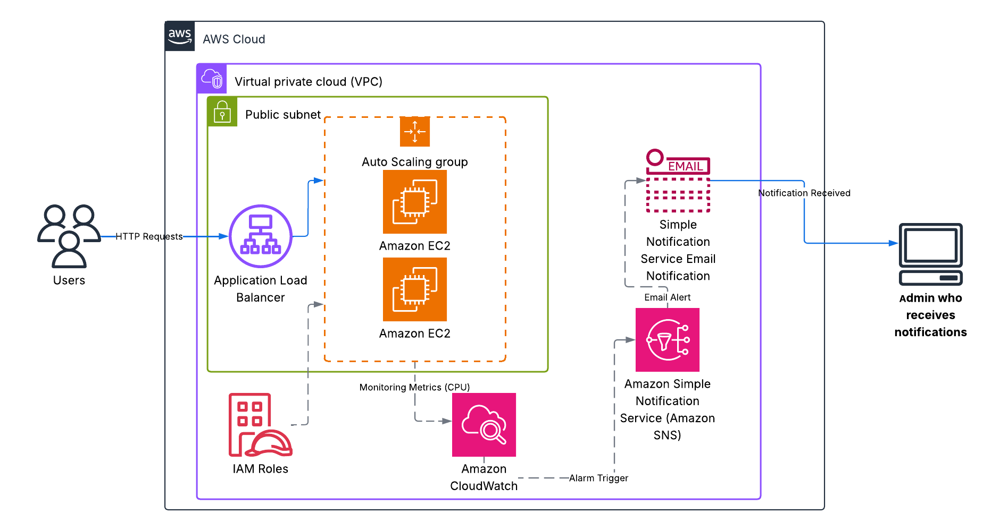

# AWS Solutions Architect - Associate Graduation Project: Scalable Web Application with ALB and Auto Scaling

**Author:** Ebram Wahba Ayad  
**Contact:** eng.ebramwahba@gmail.com  
**LinkedIn:** [Ebram Wahba](https://www.linkedin.com/in/ebram-wahba-0b197b2b0)

---

##  Project Overview

This project demonstrates the deployment of a highly available, fault-tolerant, and scalable web application on Amazon Web Services (AWS). The core objective is to establish an infrastructure that:

- Automatically adapts to varying traffic loads.
- Efficiently distributes incoming requests.
- Offers robust monitoring and alerting capabilities.

###  Key AWS Services Used

- **Amazon VPC** – Provides a secure and isolated network environment.
- **Amazon EC2** – Hosts the web application on virtual servers.
- **Amazon Machine Image (AMI)** – Standardizes server configurations.
- **EC2 Launch Templates** – Defines instance specs for Auto Scaling.
- **Auto Scaling Groups (ASG)** – Adjusts EC2 instances based on demand.
- **Application Load Balancer (ALB)** – Distributes traffic across multiple instances.
- **Amazon CloudWatch** – Enables real-time monitoring.
- **Amazon SNS** – Sends email alerts for critical events.
- **IAM Roles** – Grants secure permissions to AWS services.

This architecture follows AWS best practices in terms of scalability, security, and cost optimization.

---

##  Solution Architecture Diagram

---

##  Project Deliverables

1. **Architecture Diagram** – Located at `solution-architecture.png`.
2. **Documentation** – Complete documentation in the file `Doc Scalable Web Application with ALB and Auto Scaling`.
3. **Static Website Folder** – Contains static site files in the `resume-website/` directory.
4. **README** – This README file includes an overview and deployment process.
5. **Optional** – [Recorded Demo Video](#) *(Replace with actual link if available).*

---

##  Deployment Overview

The full deployment steps, network setup, EC2/AMI preparation, Auto Scaling configuration, monitoring setup, and notification integration are detailed in the documentation file: `Doc Scalable Web Application with ALB and Auto Scaling`.

---

##  How to Run the Project

1. Launch infrastructure using the detailed steps in the documentation.
2. Ensure public subnets and internet gateway are properly configured.
3. Create AMI from configured EC2 instance.
4. Use Launch Template and Auto Scaling Group for deployment.
5. Verify load balancing via ALB DNS.
6. Monitor using CloudWatch and receive alerts via SNS.

---

##  Live Demo 
[Visit Live Website](https://youtu.be/lGM-9IeOVa8?si=WbpjxPRtq6hG11Vl)

##  Contact

For questions or collaboration: **eng.ebramwahba@gmail.com**  
LinkedIn: [linkedin.com/in/ebram-wahba-0b197b2b0](https://www.linkedin.com/in/ebram-wahba-0b197b2b0)